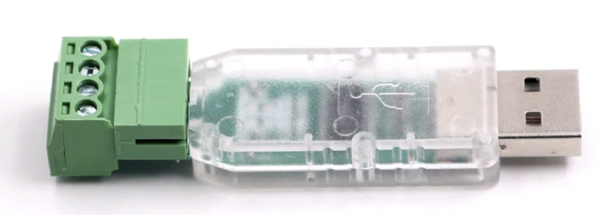
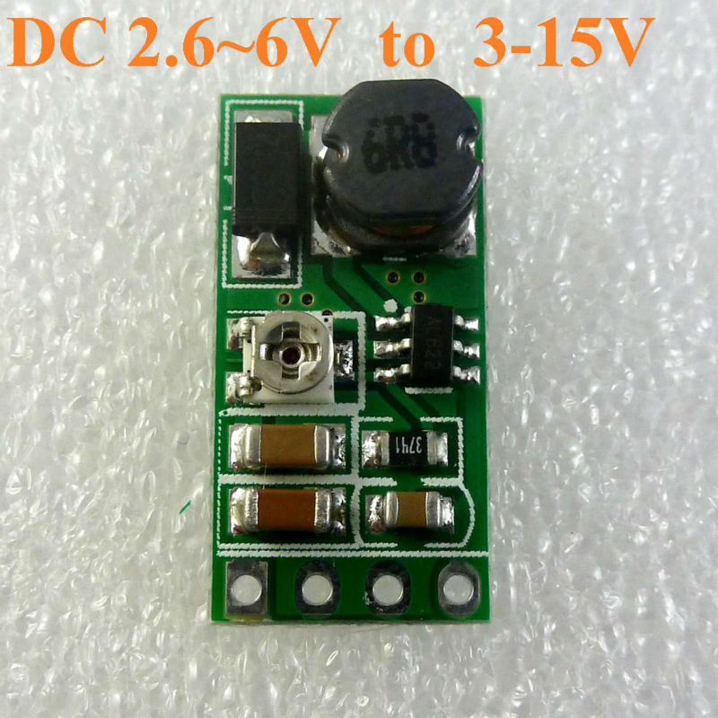
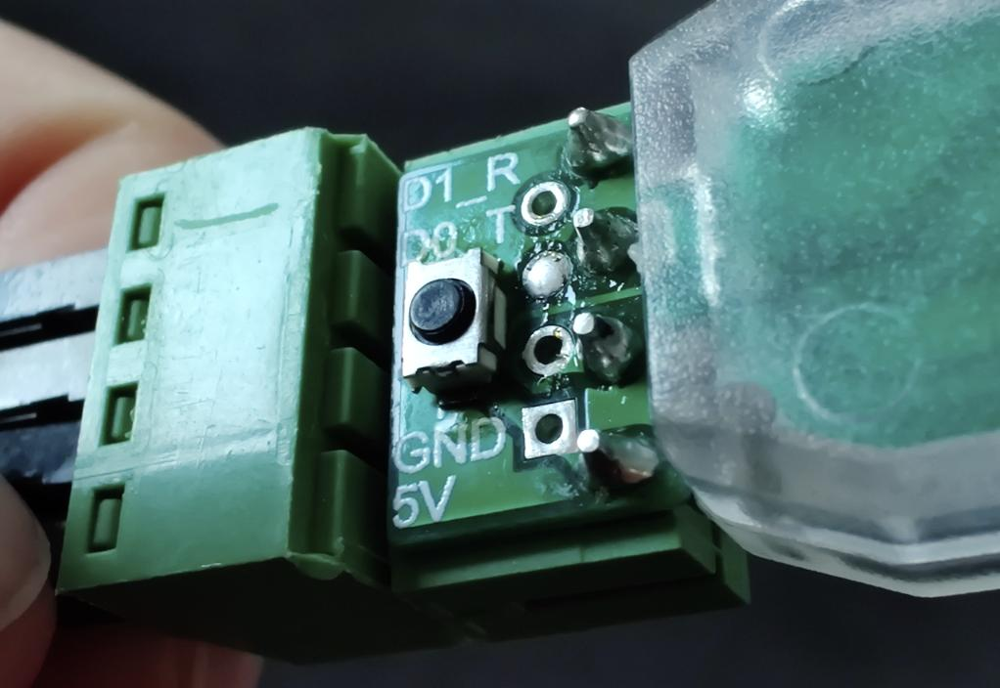

# Intro

This repository contains several firmwares for a Wiegand to USB converter I bought on Aliexpress.
I don't have the source code, I'm just sharing some notes on how they differ and how to flash the device under Linux.

At time of writing, the device is available here: https://www.aliexpress.com/item/32959259362.html (and no, I'm not affiliated with the vendor!)



[WG_USB_CONVERTER.zip](./upstream/WG_USB_CONVERTER.zip) is the file from the vendor. In [firmwares](./firmwares) I renamed some of the firmware images to avoid non-printable chars and I discarded older redundant firmwares and I provided `.bin` versions, needed for the Linux flasher.

Description by the vendor:

```
Wiegand input to USB (analog keyboard, KEYBOARD) output.
The maximum number of digits input by WG (Wiegand) is 255.
The input acquisition speed of WG (Wiegand) is fast. Each bit of low level time can be collected as low as 30us.
The output speed of USB is fast and stable. The module can output 5V voltage. This voltage is provided by USB interface.
This module provides interface source code to facilitate secondary development. Users can upgrade module functions by themselves.
size:62*29mm

Default shipment function of this module:
When the number of digits input by WG equals 8 times + 2, the two check bits (first and last) are removed and then converted to the corresponding decimal (or hexadecimal) for USB output. Finally, the output can be displayed in the file or notepad.
Examples are as follows:
WG26 input data is AA BB cc, USB output 10-Decimal : 11189196 newline (or 16-Hex AA BB CC newline)
WG34 input data volume AA BB CC dd, USB output 10-Decimal : 28644397 newline (or 16-Hex AA BB CC DD newline)

When the number of digits input by WG is not equal to the multiple of 8 + 2, it is directly converted to the corresponding decimal (or hexadecimal) to output by USB, and finally returned for a new line. The output can be displayed in the writing file or notepad.
Examples are as follows:
WG35 input data : 1010 1011 1011 1100 1100 1101 1101 111        USB output Decimal: 22915475183 newline (or Hex 555de66ef newline)
10101010101110111100110011011101111
WG37 input data : 1010 1010 1011 1011 1100 1100 1101 11101      USB output Decimal: 91661900733 newline (or Hex 1557799BBD newline)
1010101010111011110011001101110111101

Programming mode: shortcut last 2 holes (GND & square pad) while inserting USB, release => idVendor=4348, idProduct=55e0, bcdDevice= 1.00  WinChipHead
```

As seen by Windows GUI SV00xISP_AppDemo.exe

```
ISP DEV UID: 18-E4-A7-50-00-00, BTVER: 02.31
HID mode: idVendor=413d, idProduct=2107, bcdDevice= 0.00
input: HID 413d:2107 as /devices/pci0000:00/0000:00:14.0/usb1/1-1/1-1:1.0/0003:413D:2107.005A/input/input121
hid-generic 0003:413D:2107.005A: input,hidraw2: USB HID v1.11 Keyboard [HID 413d:2107] on usb-0000:00:14.0-1/input0
input: HID 413d:2107 as /devices/pci0000:00/0000:00:14.0/usb1/1-1/1-1:1.1/0003:413D:2107.005B/input/input122
hid-generic 0003:413D:2107.005B: input,hidraw3: USB HID v1.10 Mouse [HID 413d:2107] on usb-0000:00:14.0-1/input1
UART mode: idVendor=1a86, idProduct=5523, bcdDevice= 3.04
QinHeng Electronics CH341 in serial mode, usb to serial port converter
```
Linux:
```
usbcore: registered new interface driver ch341
usbserial: USB Serial support registered for ch341-uart
ch341 1-1:1.0: ch341-uart converter detected
usb 1-1: ch341-uart converter now attached to ttyUSB0
```

# Powering readers

Wiegand readers need typically to be powered with sth like 9 to 15V while the USB stick only delivers the 5V from USB.

You can easily add a step up converter such as this tiny one from Aliexpress (search for DD06AJSB)




# Setting the device under programming mode

To make it easier, I soldered a tiny button between the 2 pads to shortcut (GND & square pad).



* press button (or shortcut these 2 pads) and insert USB stick
* watch lsusb for `Bus xxx Device xxx: ID 4348:55e0 WinChipHead`

# Flashing under Linux

The firmwares came with some .exe. One can use also the [official flasher](http://www.wch-ic.com/downloads/WCHISPTool_Setup_exe.html) of CH551, still under Windows, or an open source alternative under Linux.

I first looked at https://github.com/rgwan/librech551 but the chip is not supported, see https://github.com/rgwan/librech551/issues/11 which redirects to https://github.com/NgoHungCuong/vnproch551.git so this is the one I'm using.

Usage: set device in programming mode, then e.g.

`sudo ./vnproch551 WG_TO_USB\(KeyBoard\)_DEC_\(PRE0_REMOVE\)_ENTER.bin`

# Firmwares

Testing firmwares with two tags:

`WG_TO_USB(KeyBoard)_DEC_(PRE0_REMOVE)_ENTER.hex`
```
1186243\n
68295107\n
```
`WG_TO_USB(KeyBoard)_DEC_(PRE0_REMOVE).hex`
```
1186243
68295107
```
`WG_TO_USB(KeyBoard)_DEC_(PRE0_RETAIL)_ENTER.hex`
```
01186243\n
0068295107\n
```
`WG_TO_USB(KeyBoard)_DEC_(PRE0_RETAIL).hex`
```
01186243
0068295107
```
`WG_TO_USB(KeyBoard)_HEX_(PRE0_REMOVE)_ENTER.hex`
```
1219c3\n
41219c3\n
```
`WG_TO_USB(KeyBoard)_HEX_(PRE0_REMOVE).hex`
```
1219c3
41219c3
```
`WG_TO_USB(KeyBoard)_HEX_(PRE0_RETAIL)_ENTER.hex`
```
1219c3\n
041219c3\n
```
`WG_TO_USB(KeyBoard)_HEX_(PRE0_RETAIL).hex`
```
1219c3
041219c3
```
`WG_TO_USB(KeyBoard)_WGXX__dddd__DEC_(PRE0_RETAIL)_ENTER.hex`
```
wg26    01186243\n
wg34    0068295107\n
```
`WG_TO_USB(KeyBoard)_WGXX__hhhh__HEX_(PRE0_RETAIL)_ENTER.hex`
```
wg26    1219c3\n
wg34    041219c3\n
```
`WG_TO_USB(UartCom)_CHAR_DISP_DEC_ENTER__USB(UartCom)_TO_WG.hex`
```
01186243\n
0068295107\n
```
`WG_TO_USB(UartCom)_CHAR_DISP_DEC__USB(UartCom)_TO_WG.hex`
```
01186243
0068295107
```
`WG_TO_USB(UartCom)_CHAR_DISP_HEX_ENTER__USB(UartCom)_TO_WG.hex`
```
1219C3\n
041219C3\n
```
`WG_TO_USB(UartCom)_CHAR_DISP_HEX__USB(UartCom)_TO_WG.hex`
```
1219C3
041219C3
```
`WG_TO_USB(UartCom)_CHAR_DISP_WGXX__dddd__DEC_(PRE0_RETAIL)_ENTER__USB(UartCom)_TO_WG.hex`
```
WG26    01186243\n
WG34    0068295107\n
```
`WG_TO_USB(UartCom)_CHAR_DISP_WGXX__hhhh__HEX_(PRE0_RETAIL)_ENTER__USB(UartCom)_TO_WG.hex`
```
WG26    1219C3\n
WG34    041219C3\n
```
`WG_TO_USB(UartCom)_HEX_DISP_DEC__USB(UartCom)_TO_WG.hex`

raw bytes `01 18 62 43`   
raw bytes `00 68 29 51 07`

`WG_TO_USB(UartCom)_HEX_DISP_HEX__USB(UartCom)_TO_WG.hex`

raw bytes `12 19 c3`   
raw bytes `04 12 19 c3`   


Tests sending over UART, always same mode:

Sending `1234\r\n` => Emit `0 00110001 00110010 00110011 00110100 00001101 00001010 1`   
Interpretation: raw chars `1`, `2`, `3`, `4`, `\r`, `\n` converted as bytes => 50b raw

Sending `123` => Emit `000000100000000001 1 001100010011001000110011 0`   
Interpretation: raw chars `1`, `2`, `3` converted as bytes => 26b wiegand + 18b preamble
```
          000000100000000001 1 001100010011001000110011 0
                                      1       2       3
```

Sending `1234` => Emit `0000001001 0 00110001001100100011001100110100 0`   
Interpretation: raw chars `1`, `2`, `3`, `4` converted as bytes => 34b wiegand + 10b preamble 
```
          0000001001 0 00110001001100100011001100110100 0
                              1       2       3       4
```

Beware `screen` and `minicom` send char by char => 10b raw each time.


# Python light client

Here is a little crappy script I wrote to interact with the UART firmwares and be able to send strings instead of char by char.

```python
#!/usr/bin/env python3

import sys
import time
import serial

baudrate = 9600
ser = serial.Serial(
    port='/dev/ttyUSB0',
    baudrate=baudrate,
    parity=serial.PARITY_NONE,
    stopbits=serial.STOPBITS_ONE,
    bytesize=serial.EIGHTBITS
)

ser.isOpen()
print('Enter your commands below.\r\nInsert "exit" to leave the application.')

while 1 :
    # get keyboard input
    inp = input(">> ")
    inp = inp.encode('utf8')
    if inp == 'exit':
        ser.close()
        exit()
    else:
        ser.write(inp)
        out = b''
        time.sleep(1)
        while ser.inWaiting() > 0:
            out += ser.read(1)
        if out != b'':
            print("<<HEX " + out.hex())
            try:
              print("<<RAW " + out.decode('utf8'))
            except:
              pass
```
